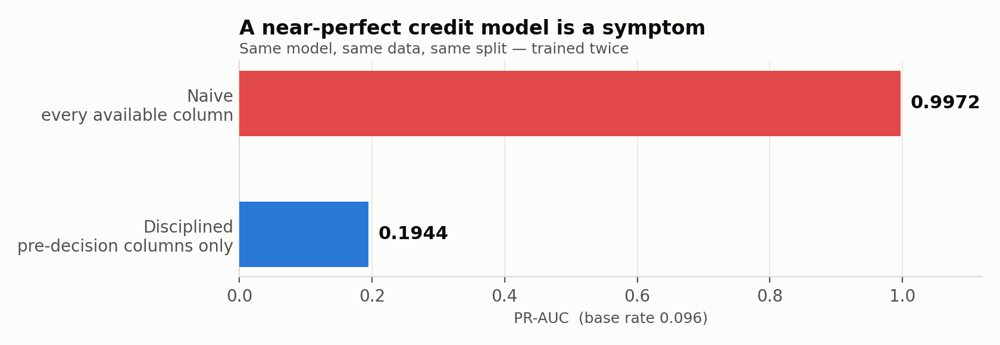
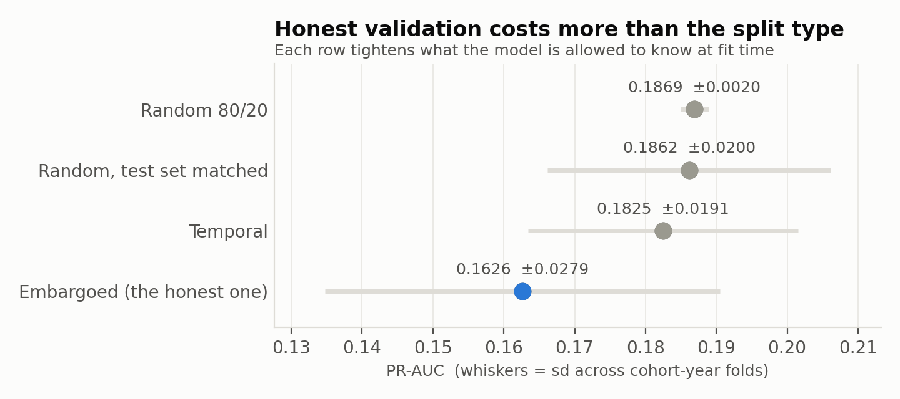
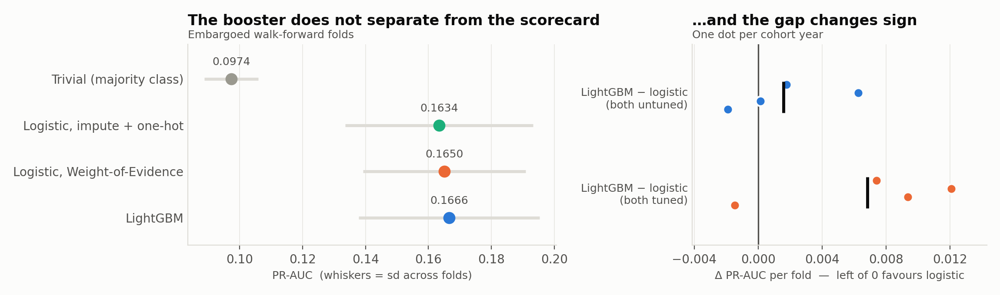
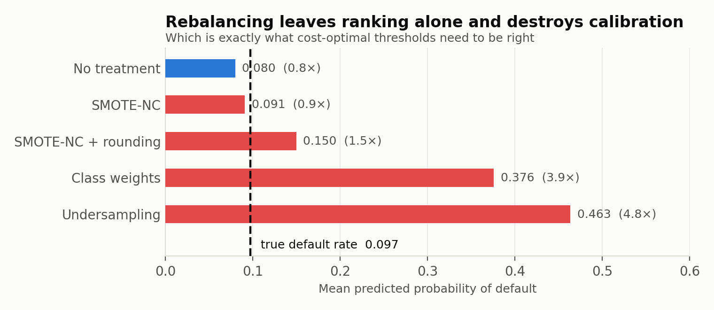
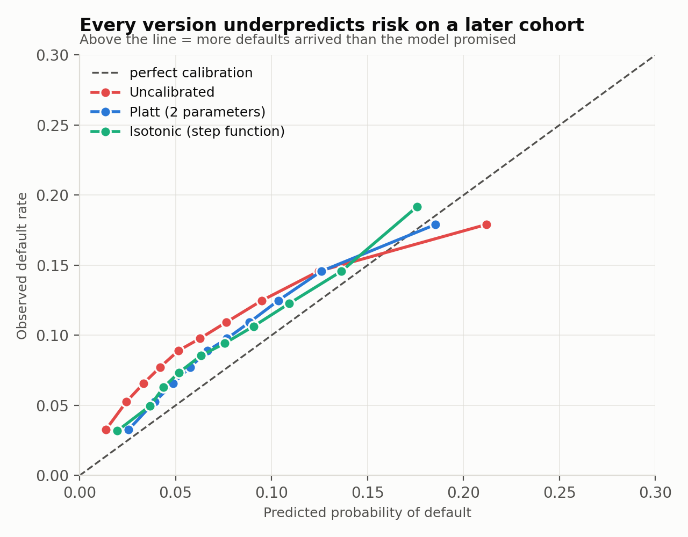
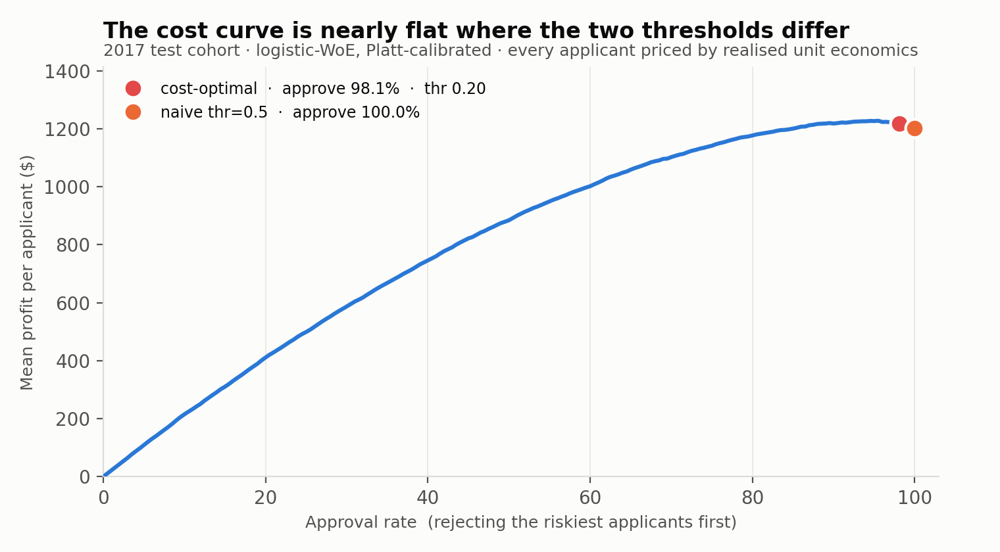

# Cost-Sensitive Credit Risk Scorecard & Audit Harness

Predicting default on 2.26M Lending Club loans (2007–2018) — built as a decision system with a governance layer (cost-optimal thresholds, calibrated probabilities, a fairness audit, temporal validation, a model card) rather than a model that stops at reporting an AUC.

> **Status: in progress.** Phases 1–6 of 8 complete (data integrity, leakage audit, temporal validation, baselines, imbalance handling, calibration, cost-sensitive decisioning, fairness audit). Explainability and packaging are not yet built. Every number below is reproducible from the committed code. See [Project status](#project-status).


## What this project found

| # | Finding | The number |
|---|---|---|
| 1 | Leakage will hand you a near-perfect model on this dataset | **+0.80** PR-AUC |
| 2 | Random splitting barely inflates the score — it hides per-cohort variance | −0.0037 |
| 3 | Training only on *matured* outcomes is what actually costs you | **−0.0131**, 4/4 folds |
| 4 | A fixed 18-month window fixes cohort comparability *and* adds 100k loans | 20% → 6.9–9.8% |
| 5 | Excluding the lender's own risk grade is not free after all | −0.0110, 5/5 seeds |
| 6 | Missingness encodes loan vintage, and the mechanism differs by column | PSI ≈ 18 |
| 7 | Gradient boosting does not beat a Weight-of-Evidence scorecard | +0.0068, **sign flips** |
| 8 | The tuning gain is overfitting correction, not capacity | ⅔ from regularisation |
| 9 | Every imbalance treatment hurt; SMOTE's null result was an illusion | **−0.0262**, 4/4 folds |
| 10 | Found in my own audit: the encoder was silently discarding 11 features | −0.0005, sign flips |
| 11 | Calibration is perishable: every calibrator converges to the same ECE floor | 0.000 → **0.019** |
| 12 | A cost-derived threshold (~0.20) barely beats naive 0.5 — risk scores rarely get that high | **+$5**/applicant, sign flips |
| 13 | A single shared threshold can't zero out demographic parity and equal opportunity at once, on any proxy | dp_gap 0.010–0.055 |

Effects that change sign across folds are reported as **null**, not as small. Every
comparison below is *paired* where the folds share a test set, because the
cohort-to-cohort spread is five times larger than most of the effects being measured.

---

## The headline: this dataset will hand you a 0.997 PR-AUC if you let it

The same model, same data, same split — trained twice. Once on every column the file offers, once on only the columns a lender would actually possess at the moment of the credit decision:

| Feature set | Features | PR-AUC | ROC-AUC | Brier |
|---|---:|---:|---:|---:|
| Naive — every available column | 139 | **0.9972** | 0.9996 | 0.0034 |
| Disciplined — pre-decision columns only | 97 | **0.1944** | 0.6971 | 0.0830 |



A near-perfect credit risk model is not an achievement, it's a symptom. The naive version scores 0.997 because 38 of its columns — `recoveries`, `total_pymnt`, `last_fico_range_high`, the hardship-programme fields, the debt-settlement fields — only get populated *after* the loan is funded, and several only exist for loans that already went bad. The model isn't predicting the outcome; it's reading it.

**0.19 is what this problem actually looks like.** (PR-AUC against a 9.63% base rate; ROC-AUC 0.70.)

## Key findings

**1. The leakage gap is large enough to be self-diagnosing.** +0.80 PR-AUC between the naive and disciplined feature sets. Any credit model reporting near-perfect discrimination should be assumed broken until proven otherwise. This is the single most common silent failure in public work on this dataset.

**2. Random splitting barely inflates the score. What it hides is per-cohort variability — and the mechanism is the evaluation scheme, not the training scheme.** Four regimes, identical sample sizes:

| Split regime | PR-AUC | sd across folds | Tests on |
|---|---:|---:|---|
| Random (plain 80/20) | 0.1869 | **0.0020** | mixed pool, all cohorts |
| Random, test set matched | 0.1862 | **0.0200** | one cohort year |
| Temporal (train on earlier cohorts only) | 0.1825 | **0.0191** | one cohort year |
| Embargoed (only matured outcomes) | 0.1626 | **0.0279** | one cohort year |



Letting training see the future costs almost nothing: **−0.0037** with the test set held fixed. Because the regimes share an identical test set within each fold, that difference is *paired* — cohort variance cancels, and the noise drops roughly tenfold: **paired sd 0.0021** against unpaired fold-to-fold sds of 0.019–0.020, with all four folds agreeing in sign (−0.0040, −0.0043, −0.0058, −0.0007). Quoting a difference of means against a spread five times the effect would have invited the fair question of whether it differs from zero at all; paired, it clearly does.

An earlier version of this analysis reported the sd difference (0.0020 vs 0.0191) as evidence that "random splitting erases the variance". That attributed to the training scheme what is actually caused by the evaluation scheme: hold the test set fixed and random training shows sd 0.0200, essentially identical to temporal's 0.0191. The practical warning survives in corrected form — a practitioner running one random 80/20 reports a single confident number and never learns that per-cohort performance ranges **0.16 to 0.20** — but the cause is evaluating on a mixed pool, not shuffling the training data.

**3. The honest constraint costs far more than the split type — and it costs most where the data drifts fastest.** The *embargoed* regime trains only on cohorts whose 18-month outcomes were already known when the model would have been fitted — to predict year Y, train on loans issued before January of Y−2. That's the constraint a real underwriting deployment faces, and almost nobody implements it.

Isolating it properly required matching training sizes, because the raw gaps (−0.0344, −0.0282, −0.0097, −0.0071) track how much embargoed data each fold had. Capping both regimes at the embargo pool's size, all four folds:

| Fold | n (both) | Raw gap | Size-matched gap |
|---|---:|---:|---:|
| 2014 | 39,786 | −0.0344 | **−0.0172** |
| 2015 | 93,153 | −0.0282 | **−0.0184** |
| 2016 | 150,000 | −0.0097 | −0.0097 |
| 2017 | 150,000 | −0.0071 | −0.0071 |

**Embargo penalty: −0.0131 (sd 0.0055), all four folds, same sign** — about 3.5× the cost of temporal splitting alone. Sample size explained roughly half the 2014 gap and a third of 2015's, but not the rest: even at equal n, the early folds cost **2.1× more** than the late ones (−0.0178 vs −0.0084). A 24-month embargo forces the 2014 fold to train on pre-2012 loans — a very different population, missing the bureau fields entirely — while 2016 only reaches back to 2013. **The embargo hurts most exactly where the drift analysis says the population moved most.**

Confirmed not to be a data-volume artifact: on the 2016 fold the gap is flat across training sizes (−0.0094 at 25k, −0.0097 at 150k). Reproduce with `python -m models.validation_robustness`.

**4. Cohorts weren't comparable, and fixing it grew the dataset.** Defaults resolve fast; repayments resolve slowly. So a partly-matured cohort is enriched with whichever outcome finishes sooner — the 2016 and 2017 cohorts showed ~20% default against 12–15% for fully-resolved years, then 2018 fell *back* to 13%. The bias reverses direction with cohort age. Replacing "did it ever default" with "did it default within 18 months" flattens that to 6.9–9.8%, a shape consistent with a real credit cycle. It also *added* 100,000 loans, because a 2016 loan still performing in 2019 demonstrably did not default within 18 months — a known outcome the old target was discarding as unknown.

**5. Revised: Lending Club's own risk grade is not free to exclude after all.** `grade`, `sub_grade`, `int_rate` and `installment` are outputs of Lending Club's underwriting model rather than raw applicant characteristics, so training on them risks re-deriving their decision instead of learning the underlying risk. Measured across five seeds, adding them back is worth **+0.0110 PR-AUC (sd 0.0026), positive on every seed** — against a seed-to-seed spread in the baseline of only 0.0020. That is five times the measurement noise, roughly a 6% relative gain. An earlier version of this project measured +0.0037 on the retired target and called the exclusion costless; on the current target that claim is wrong. The columns are still excluded, on the circularity argument — but the decision now carries a real, stated price rather than a free one.

**6. Missingness encodes loan vintage, and the mechanism differs by column.** Fourteen bureau-enrichment columns are **100% missing before 2016 and ~0% after**, because Lending Club introduced the fields partway through. Six `mths_since_*` columns are missing because *the event never happened to that borrower* — median-imputing those would replace "never delinquent" with "delinquent a while ago" and invert the signal. Same headline percentage, opposite handling.

| Null rate (%) by issue year | 2013 | 2014 | 2015 | 2016 | 2017 |
|---|---:|---:|---:|---:|---:|
| `open_acc_6m` (field introduced) | 100 | 100 | 95 | **0** | **0** |
| `mths_since_last_delinq` (event never occurred) | 57 | 49 | 48 | 47 | 50 |

That Phase 1 finding predicted exactly which features would break temporal validation. The drift analysis confirms it independently: those same fourteen columns register **PSI ≈ 18** against a "significant" threshold of 0.25, with *undefined* KS — meaning they moved entirely in availability, not in the values they report. Full taxonomy in [`reports/data_quality.md`](reports/data_quality.md), full drift table in [`reports/drift.md`](reports/drift.md).

**7. Gradient boosting does not beat a logistic regression here, and tuning does not rescue it.** Four models on the embargoed folds:

| Model | PR-AUC | sd | ROC-AUC | KS | Brier |
|---|---:|---:|---:|---:|---:|
| Trivial (majority class) | 0.0974 | 0.0086 | 0.5000 | 0.0000 | 0.0882 |
| Logistic, median-impute + one-hot | 0.1634 | 0.0298 | 0.6577 | 0.2306 | 0.0864 |
| Logistic, Weight-of-Evidence | 0.1650 | 0.0259 | 0.6583 | 0.2294 | 0.0857 |
| LightGBM, untuned | 0.1666 | 0.0287 | 0.6598 | 0.2324 | 0.0859 |



Untuned, LightGBM over logistic-WoE is **+0.0016 with the sign flipping across folds** — indistinguishable from zero.

**Both models were then given the same eight-configuration nested search**, ranked on an inner temporal split of each fold's own training window so the reported folds never influence selection. Tuning one side and not the other would have made the comparison worthless:

| | Gain from tuning | Paired sd | Same sign |
|---|---:|---:|---|
| LightGBM | **+0.0059** | 0.0038 | Yes (4/4) |
| Logistic-WoE | +0.0006 | 0.0008 | No |

The booster needs tuning; the scorecard was already at its ceiling. **Tuned against tuned, the gap is +0.0068 (paired sd 0.0059), and it still flips sign** — negative on the 2014 fold. Four folds cannot establish an effect that small.

The honest summary: **on this problem, a 1960s-vintage scorecard technique matches a modern gradient booster**, and the booster costs interpretability a credit regulator would ask for. The trivial model makes the companion point — it scores **90.3% accuracy** while catching zero defaults, which is why accuracy appears nowhere else in this README.

**8. The tuning gain is overfitting correction, not capacity.** "Tuning helped" explains nothing, so the gain was decomposed. Every configuration the search selected used `num_leaves=15` against a default of 31 and `min_child_samples` of 100–200 against 20; the grid also carried row and column subsampling that no configuration varied. Separating them:

| Variant | vs untuned baseline | Paired sd | Same sign |
|---|---:|---:|---|
| Bagging only (`subsample`/`colsample` 0.8) | +0.0015 | 0.0020 | No |
| Lower capacity + L2 only | **+0.0037** | 0.0020 | **Yes (4/4)** |
| Both (what the search actually fitted) | +0.0056 | 0.0038 | Yes (4/4) |

Two-thirds of the gain is capacity reduction and explicit L2; bagging alone does not clear its own noise. The effects are additive (interaction +0.0003). That is the expected shape when the early training windows hold ~40,000 loans and, per Phase 1, **66 of 87 numeric features are entirely null inside the 2014 embargoed window** — the default 31-leaf tree simply has more capacity than the data supports. Reproduce with `python -m models.gbm_ablation`.

**9. Every imbalance treatment made things worse, and SMOTE's null result was an illusion.** Four treatments against doing nothing, same folds, same model:

| Treatment | Δ PR-AUC | Paired sd | Same sign | Mean predicted p | Brier |
|---|---:|---:|---|---:|---:|
| Class weights (`balanced`) | −0.0033 | 0.0041 | No | 0.376 (3.9× true) | 0.1787 |
| Random undersampling | **−0.0057** | 0.0024 | **Yes (4/4)** | 0.463 (4.8× true) | 0.2409 |
| SMOTE-NC | −0.0015 | 0.0048 | No | 0.091 | 0.0862 |
| SMOTE-NC + integer rounding | **−0.0262** | 0.0082 | **Yes (4/4)** | 0.150 | 0.0979 |
| *(no treatment)* | — | — | — | 0.080 (true rate 0.097) | 0.0859 |



Nothing improved ranking, which is expected: PR-AUC, ROC-AUC and KS depend only on score *order*, and rebalancing applies a roughly monotone shift. What rebalancing does destroy is calibration — undersampling predicts a default probability **4.8× the truth** and nearly triples Brier — and Phases 4 and 5 need probabilities that mean what they say. Undersampling also discards ~84% of the training rows.

The interesting case is SMOTE. Its apparent harmlessness is an artefact: **a classifier can separate SMOTE's synthetic defaults from real ones at ROC-AUC 1.0000.** **51 of the 58 numeric features observed in that training window take only whole-number values in real data, and interpolation makes every one of them fractional** (`revol_bal` in 99.7% of synthetic rows, FICO band endpoints in 92%) — a borrower with 7.43 open accounts does not exist. The booster learns `is_synthetic`, which predicts the positive label perfectly in training and does not exist at scoring time, so it partitions the synthetic half away and trains on the real half. That is why a model fitted on a 50/50 book still predicts a test mean of 0.091 while undersampling on an equally balanced book predicts 0.463.

Removing the tell confirms it. Rounding the integer features so synthetic rows are no longer trivially detectable forces the model to actually learn from them — and performance collapses by **−0.0262 on all four folds**, seventeen times the unrounded effect. SMOTE was not neutral; it was being ignored, and it only looked neutral because of a flaw that also made it detectable. Mechanism and both tests in [`reports/smote_diagnostic.md`](reports/smote_diagnostic.md).

**10. Found in audit: the WoE encoder was silently discarding 11 of the scorecard's 58 usable features.** Quantile binning fails without error on a column where one value holds more than 1/`n_bins` of the mass: every quantile lands on that value, the bin edges deduplicate to fewer than three, and the encoder falls through to a branch that maps every non-null value into a single bucket. The feature becomes a constant.

On this data that is not an edge case. In the 2016 fold it destroyed exactly the fields a credit model most wants:

| Feature | Share at the modal value | Fate before the fix |
|---|---:|---|
| `acc_now_delinq` | 99.8% | one bin |
| `tax_liens` | 99.3% | one bin |
| `pub_rec_bankruptcies` | 92.2% | one bin |
| `pub_rec` | 91.5% | one bin |
| `num_tl_90g_dpd_24m` | 67.1% | one bin |
| `tot_coll_amt` | 64.2% | one bin |

`evaluation/drift.py` had already hit the identical failure computing PSI and carried a fix; `features/woe.py` never got it. Two modules in the same repo, one of which had learned the lesson.

**The fix, and the honest result:** giving the modal value its own bin and quantile-binning the remainder recovers all 11 features — and changes PR-AUC by **−0.0005, with the sign flipping**. Their information values are 0.0002–0.0011, so they carried essentially no signal and adding them back to a linear model is marginally *harmful*. The bug was real and worth fixing on the merits — a scorecard that silently drops public records and tax liens is indefensible to an auditor regardless of what it costs in PR-AUC — but the headline did not depend on it. The three models that do not use WoE reproduced to six decimal places, confirming nothing else moved.


**11. Calibration: the booster's probabilities are the worst thing about it, and no calibrator beats temporal drift.** Everything above is a *ranking* metric. Phase 5 cannot use a ranking — choosing a cut-off by expected cost needs a number that means what it says. Two models, three treatments, calibrator fitted on the most recent cohort inside the embargoed window and applied to a test cohort two or more years later:

| Model | Calibrator | Brier | ECE | Slope | Mean predicted | Observed |
|---|---|---:|---:|---:|---:|---:|
| LightGBM | none | 0.0874 | **0.0308** | **0.59** | 0.0735 | 0.0974 |
| LightGBM | Platt | 0.0865 | 0.0190 | 0.79 | 0.0818 | 0.0974 |
| LightGBM | isotonic | 0.0864 | 0.0191 | 0.72 | 0.0816 | 0.0974 |
| Logistic-WoE | none | 0.0864 | 0.0203 | 0.75 | 0.0808 | 0.0974 |
| Logistic-WoE | Platt | 0.0864 | 0.0183 | 0.86 | 0.0821 | 0.0974 |
| Logistic-WoE | isotonic | 0.0864 | 0.0183 | 0.80 | 0.0823 | 0.0974 |

**The scorecard arrives nearly calibrated; the booster does not.** Uncalibrated LightGBM has an ECE of 0.0308 and a calibration slope of 0.59, and predicts a mean default probability of 0.0735 against 0.0974 observed — it under-promises risk by a quarter. Calibrating it is worth **−0.0118 ECE (paired sd 0.0106, all four folds)**. Doing the same to the scorecard is worth −0.0021 with the sign flipping: nothing. That is a third independent count against the booster — it does not rank better, its gain came from regularisation, and its probabilities need repair the scorecard's do not.



**Platt strictly dominates isotonic here, and the reason is worth knowing.** They reach identical calibration (ECE 0.0183 vs 0.0183 on the scorecard, 0.0190 vs 0.0191 on the booster). But Platt is a two-parameter monotone squeeze, so it leaves ranking *exactly* untouched — PR-AUC changes by 0.00000. Isotonic is a step function, and it **collapses 100,000 distinct predictions into 98 distinct values**, costing −0.0035 PR-AUC. For Phase 5 that matters more than the PR-AUC: a cost-optimal threshold needs somewhere to sit, and isotonic leaves only 98 places to put it.

**The finding that only a temporally-validated project can produce.** Calibration is normally taught as if the world were stationary. Score each calibrator twice — on the cohort it was fitted on, and on the test cohort:

| Calibrator | ECE on its own cohort | ECE on the test cohort |
|---|---:|---:|
| none | 0.0147 | 0.0308 |
| Platt | 0.0039 | **0.0190** |
| isotonic | **0.0000** | **0.0191** |

Isotonic achieves *perfect* calibration on the cohort it was fitted to and lands in exactly the same place as Platt two years later. **Every calibrator converges to an ECE floor of about 0.019 regardless of how well it fits its own data** — flexibility buys nothing once the cohort changes. The mechanism is visible in the base rates: the calibration cohort defaults at 7.6–8.7%, the test cohort at 8.7–10.7%, a gap of **+0.9 to +2.9 points** the calibrator cannot know about. Even after calibration the models still predict 0.082 against 0.097 observed. On drifting data, calibration is a perishable good.

**12. A cost-optimal threshold barely beats naive 0.5 here — and the reason is more interesting than the result.** A probability is only useful if it changes a decision. Every applicant is priced with two rates measured from loans whose lifetime outcome is fully known (not the 18-month proxy `default_window` — a deliberate, stated gap; see [`DECISIONS.md`](DECISIONS.md) decision 11): loss-given-default and realised margin, both dollar-weighted and scaled by that applicant's own loan amount.

| Rate | Value | Reading |
|---|---:|---|
| Loss given default | **0.653** | a defaulted $10,000 loan loses ~$6,534 net of recoveries |
| Margin, realised | **0.165** | a performing $10,000 loan earns ~$1,646 in collected interest |
| Margin, full-term formula | 0.483 | 3× the realised figure — most loans pay off before term |

The threshold that maximises expected profit is found by an *exact* search over every distinct calibrated score (no grid, verified against brute force in `tests/test_decisioning.py`), on the Platt-calibrated logistic-WoE scorecard:

| Fold | Threshold | Approve rate | Profit/applicant | vs. naive 0.5 | Threshold-drift cost |
|---|---:|---:|---:|---:|---:|
| 2014 | 0.228 | 99.2% | $1,379 | −$7 | $8 (0.6% of oracle) |
| 2015 | 0.200 | 98.1% | $1,227 | +$7 | $3 (0.2%) |
| 2016 | 0.237 | 99.4% | $1,066 | +$7 | $27 (2.5%) |
| 2017 | 0.197 | 98.1% | $1,217 | +$14 | $12 (1.0%) |



**Mean gain over a flat 0.5 cutoff: +$5.42/applicant (sd $8.96), sign flips in 1 of 4 folds — null by this project's own standard.** The reason is visible in the figure: calibrated scores never exceed 0.45 in any fold, so at this base rate almost no applicant scores anywhere near 0.5. "Reject above 0.5" and "approve nearly everyone" are almost the same policy, so the two thresholds only disagree on the 1–4% of applicants scored between them — small money averaged across the whole population. This is not the textbook result, and it is reported as measured rather than adjusted to fit the expectation. A closed-form cross-check confirms the search is finding the right number anyway: ignoring score shape, the break-even point is `margin/(margin+lgd)` = 0.165/0.818 = **0.202**, and the four measured thresholds (0.197–0.237) sit right around it.

**Extending past the brief: does the threshold itself drift the way calibration does?** Decision 10 found calibration converges to the same error floor two-plus years out. Pricing the threshold picked on the most recent available cohort against the threshold that would have been optimal on the test cohort itself (an oracle, not something deployable in advance) gives **a mean drift cost of $12.47/applicant (sd $10.48), 1.1% of oracle profit** — real, but an order of magnitude smaller *in relative terms* than calibration's own drift. The mechanism is the same flat-topped curve visible above: the optimum sits where profit barely changes with the threshold, so a several-point shift in exactly where the cutoff sits costs little even though the underlying probabilities moved.

**Sensitivity: a ±30% swing in either cost assumption moves the threshold by 0.05–0.07** (probability units) in the expected direction — a higher loss-given-default tightens the cutoff, a higher margin loosens it. The number 0.20 is a function of the stated assumptions, not a constant; a real deployment would need to revisit both rates periodically, which is a monitoring requirement rather than something a better search procedure fixes.

**13. Fairness: three imperfect proxies, and a single threshold can't satisfy both fairness criteria at once.** Lending Club's public data contains no race, sex, or age — so the audit uses three proxies, each stated as imperfect rather than treated as ground truth: `income_quintile`, `emp_length`, and `geo_race_proxy` (each loan's ZIP3 mapped to the Census-measured plurality race/ethnicity of that ZIP3's population — weaker than the surname+geography BISG method regulators use, since LC has no borrower name, and it inherits the ecological fallacy: an individual borrower's actual race is never observed). All three are evaluated at Phase 5's own cost-optimal shared threshold, not a threshold picked for this purpose:

| Proxy | Model | Demographic parity gap | Disparate impact ratio | Equal-opportunity gap |
|---|---|---:|---:|---:|
| income_quintile | logistic_woe | 0.024 (sd 0.015) | 0.98 | 0.022 (sd 0.013) |
| income_quintile | lightgbm | 0.018 (sd 0.015) | 0.98 | 0.017 (sd 0.014) |
| emp_length | logistic_woe | **0.055 (sd 0.030)** | 0.94 | 0.052 (sd 0.029) |
| emp_length | lightgbm | 0.019 (sd 0.010) | 0.98 | 0.019 (sd 0.010) |
| geo_race_proxy | logistic_woe | 0.011 (sd 0.005) | 0.99 | 0.010 (sd 0.005) |
| geo_race_proxy | lightgbm | 0.010 (sd 0.004) | 0.99 | 0.011 (sd 0.008) |

`fairness/metrics.py` cites the classical result (Chouldechova 2017; Kleinberg, Mullainathan & Raghavan 2016): a single shared threshold cannot generally zero out both demographic parity and equalized odds when base rates differ across groups. The base rates here do differ — `income_quintile`'s top bracket defaults at 7.5% against 12.0% for its bottom bracket — and the table is the demonstration: at Phase 5's shared threshold, every proxy shows *both* gaps simultaneously nonzero. Worth stating plainly: that threshold approves 96–99.7% of applicants in every fold, and when approval is that close to universal, a group's approval rate and its true-positive rate numerically converge, which mutes this tension. A stricter, more typical lending approval rate would very likely show it more sharply — this project has not yet built and committed the code to measure that precisely (see [`DECISIONS.md`](DECISIONS.md) open items), so it is stated as a caveat rather than a number.

**Per-group thresholds (fit on the calibration cohort) can close either gap — and closing one isn't free.** Two mitigations were tried per proxy, `demographic_parity` and `equal_opportunity`, each targeting the population-wide rate the shared threshold already achieves:

| Proxy | Model | Mitigation | Cost ($/applicant) | Resulting DP gap | Resulting EO gap |
|---|---|---|---:|---:|---:|
| income_quintile | logistic_woe | demographic_parity | −$1.08 (sd 2.36) | 0.006 | 0.006 |
| emp_length | logistic_woe | demographic_parity | −$1.03 (sd 1.09) | 0.006 | 0.007 |
| geo_race_proxy | logistic_woe | demographic_parity | −$0.53 (sd 0.41) | 0.012 | 0.011 |
| geo_race_proxy | lightgbm | demographic_parity | **+$0.28 (sd 0.65)** | 0.022 | 0.021 |

Most of these costs aren't distinguishable from zero given n=4 folds and a cost sd 1–4× the mean — negative-mean rows mean "not measurably different from free," not "fairness paid for itself" (same reasoning as finding 12's naive-threshold result). The one cost that clears its own noise in the expected direction is `geo_race_proxy`/lightgbm, a small, honestly-reported +$0.28/applicant.

**A real bug, caught only after real Census data arrived.** The first real-data run showed `geo_race_proxy`'s mitigated demographic-parity gap at 0.117 — *worse* than its 0.026 baseline. Cause: 5 of 894 ZIP3s Census flags `insufficient_data` (population under 500, or no ZCTA match at all) carry only 33–49 loans per 100k-loan fold; treated as an ordinary group, that tiny N produced a noisy ~100% baseline approval rate that a per-group mitigation threshold amplified rather than corrected. Fixed by excluding those loans from the comparison entirely (162 test-cohort loans across all folds, ~0.04% of the dataset) — a Census data-quality flag is not a demographic group, and the "measure, don't assume" standard this project holds elsewhere caught it only because real data, not synthetic fixtures, was run through the full pipeline before trusting the result. Full reasoning in [`DECISIONS.md`](DECISIONS.md) decision 12.

## Target definition

`default_window = 1` if the loan charged off having stopped paying within **18 months of origination**; `0` if it survived that window. A loan is eligible only once observed for 18 + 6 months, the extra six covering the ~120–150 day delinquency-to-charge-off lag.

Window length chosen from the data, not convention: median time from origination to final payment on charged-off 36-month loans is 17 months, and 18 months captures 56% of eventual charge-offs versus 34% at twelve.

**Population: 1,445,560 loans, 9.63% default rate.** The target means "defaulted early", not "ever defaulted" — a narrower question, but one measured identically across every cohort. Superseded the original final-status target; see [`DECISIONS.md`](DECISIONS.md) decision 5.

## Validation design

Four walk-forward folds (test years 2014–2017), four regimes at identical sample sizes. The `random_matched` regime exists specifically so the headline gap is read off a comparison where only the training selection varies; plain `random` is reported for reference as the practice being critiqued, but its test population differs and it should not be used for the gap. Metrics reported as a distribution across folds, never a single number. Results in [`reports/temporal_validation.csv`](reports/temporal_validation.csv).

Covariate drift between the 2013–14 baseline and later cohorts: **18 of 97 features show significant drift (PSI > 0.25), 12 moderate, 67 stable.** Nulls are carried as an explicit PSI bin — without that, field introduction is invisible, and it is the largest distributional shift in the dataset. The one drifter that isn't a missingness artifact is `initial_list_status` (PSI 0.50): whole-loan listings went from 7% of originations in 2012 to 77% in 2016, a genuine platform change.

## The leakage audit

All 151 raw columns classified individually with a stated reason each — an allow-list, not a drop-list. Full detail in [`data/feature_audit.py`](data/feature_audit.py); reasoning for this and every other modelling decision in [`DECISIONS.md`](DECISIONS.md).

| Decision | Count | What it covers |
|---|---:|---|
| `keep` | 101 | Application data and the credit-bureau report pulled for it |
| `drop_leakage` | 38 | Payment history, recoveries, post-origination FICO pulls, hardship (15) and debt-settlement (7) programmes |
| `drop_other` | 8 | Identifiers, constants, redundant columns, and the label source |
| `review` | 4 | `grade` / `sub_grade` / `int_rate` / `installment` — see finding 5 |

## Limitations

Stated plainly, because they bound what the current numbers mean:

- **Discrimination is modest in absolute terms.** The best honest configuration reaches PR-AUC ~0.17 against a 0.097 base rate, ROC-AUC ~0.66. That is what this feature set supports once leakage and the embargo are respected; published numbers far above it on this dataset are almost always one of the two failures Phase 1 and Phase 2 measure.
- **`logistic_raw` silently drops all-null training features.** scikit-learn's `SimpleImputer` skips columns with no observed value, so in the 2014 fold it discards 66 of 87 numeric features rather than erroring. Those columns carry no information in that window and neither WoE nor LightGBM can use them either, so the comparison stays fair — but the pipeline reports it as a warning, not a failure, which is worth knowing before trusting any imputer on vintage-partitioned data.
- **Four folds is few.** Every paired comparison rests on n=4, which is enough to establish a consistent-sign effect of ~0.006 but not to resolve differences below ~0.002. Effects that flip sign are reported as null rather than as small.
- **Survivorship bias is partly mitigated, not eliminated.** The fixed window recovers 265,871 previously-discarded loans, but cohorts after early 2017 are still excluded for lack of maturity.
- **Loans delinquent-but-not-yet-charged-off at snapshot count as survivals.** ~1.5% of the file; some will eventually charge off, so the measured rate is slightly conservative.
- **Free-text and high-cardinality columns are unused.** `emp_title`, `desc`, `title` and raw `zip_code` are on the allow-list but not yet engineered into features.
- **Proxy fairness only.** The dataset contains no direct protected attributes; the audit uses income, employment length, and a Census-derived geography proxy as imperfect stand-ins, which bounds the conclusions it can support. `geo_race_proxy` specifically labels a ZIP3's plurality demographic, not any individual borrower's race — see finding 13.
- **The fairness tension was measured at one operating point.** Phase 5's near-universal-approval threshold (96–99.7%) mutes the demographic-parity/equal-opportunity trade-off numerically; a stricter approval rate would likely show it more sharply, and this project hasn't yet built the code to measure that precisely.
- **Unit economics are portfolio averages, not per-applicant pricing.** Loss-given-default and margin rates (decision 11) are scaled by an applicant's own loan amount but not by term, grade, or vintage beyond that, and margin specifically moves across cohorts (0.14–0.23) without correction.

## Repo layout

```
data/        loading, target definition, per-column leakage audit, data quality
features/    Weight-of-Evidence encoding
models/      training and experiments
evaluation/  drift, calibration, and cost-sensitive decisioning
fairness/    group metrics, Census geography proxy, and mitigation
reports/     generated analysis output and figures
tests/       64 tests, runnable without the dataset (the Census fetch itself is not — see Reproducing)
```

## Reproducing

```bash
# Python 3.10+
pip install -r requirements.txt

# Download accepted_2007_to_2018Q4.csv from the Kaggle dataset
# "wordsforthewise/lending-club" and place it in data/raw/
python -m data.convert_raw          # CSV -> 46 chunked Parquet files (~2 min)
python -m data.quality_report       # missingness mechanisms, cardinality, coverage
python -m data.vintage_target       # target definition + cohort comparability
python -m models.leakage_experiment # the three-way leakage comparison
python -m models.seed_stability     # is the grade/int_rate effect above noise?
python -m models.temporal_validation# walk-forward folds, three split regimes
python -m evaluation.drift          # PSI / KS drift table
python -m models.validation_robustness # paired folds + embargo robustness checks
python -m models.baselines          # trivial / logistic (WoE, naive) / LightGBM
python -m models.tuning             # nested hyperparameter search (LightGBM)
python -m models.logistic_tuning    # the same search budget for the scorecard
python -m models.gbm_ablation       # which knob produced the tuning gain
python -m models.imbalance          # none / weights / undersample / SMOTE
python -m models.smote_diagnostic   # why SMOTE has no effect here
python -m evaluation.calibration    # none / Platt / isotonic, and drift
python -m evaluation.decisioning    # unit economics, cost-optimal threshold, drift, sensitivity
LC_CENSUS_API_KEY=<your key> python -m fairness.geo_proxy  # OPTIONAL: refetch the Census geography proxy
                                     # (not needed to reproduce -- data/processed/census_zip3_race_proxy.csv
                                     # is committed; api.census.gov also isn't reachable from every network)
python -m fairness.audit            # group fairness metrics, impossibility result, mitigation cost
python reports/make_figures.py      # regenerate the README figures from the CSVs

pytest                              # 64 tests, no data files needed
```

Runs are seeded (`random_state=42`) and dependencies pinned. The raw CSV is ~1.6GB and the Parquet output ~400MB; neither is committed. `LC_RAW_CSV` and `LC_PARQUET_DIR` override the default data locations. `data/processed/census_zip3_race_proxy.csv` (894 ZIP3 rows, public Census ACS data, ~170KB) *is* committed, specifically so `fairness.audit`'s geography numbers reproduce without a Census API key.

## Project status

| Phase | Status |
|---|---|
| 1. Data integrity & leakage audit | Complete |
| 2. Temporal validation design | Complete |
| 3. Baselines & imbalance handling | Complete |
| 4. Calibration | Complete |
| 5. Cost-sensitive decisioning | Complete |
| 6. Fairness & bias audit | Complete |
| 7. Explainability | Next |
| 8. Model card & packaging | Not started |

## Data

[Lending Club accepted loans, 2007–2018](https://www.kaggle.com/datasets/wordsforthewise/lending-club) (Kaggle) — 2,260,701 loans, 151 columns, origination dates spanning June 2007 to December 2018 with no missing months.
